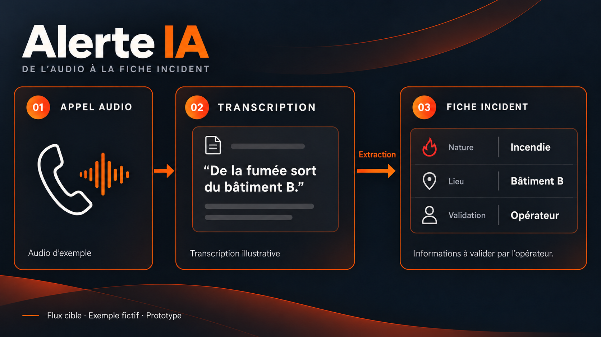
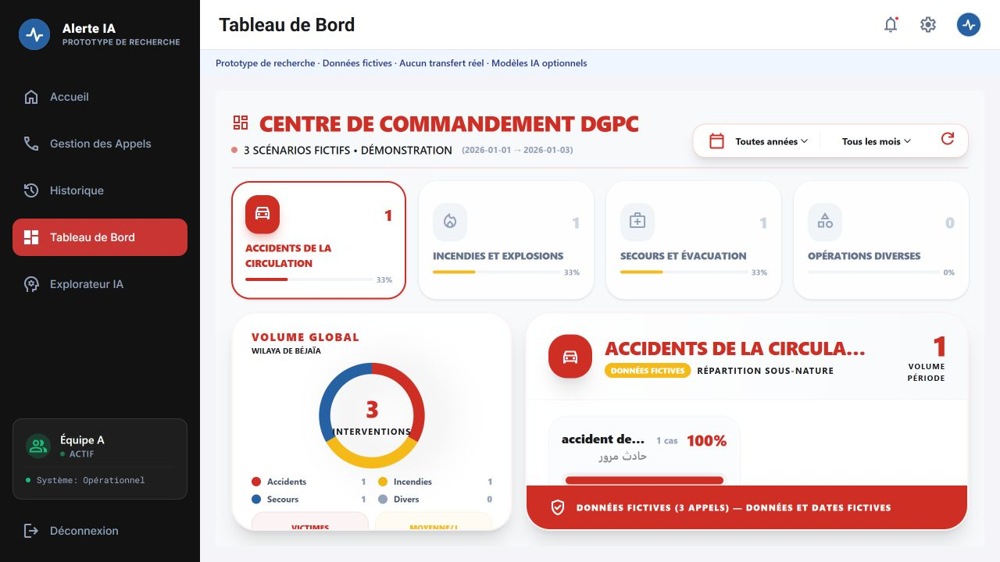
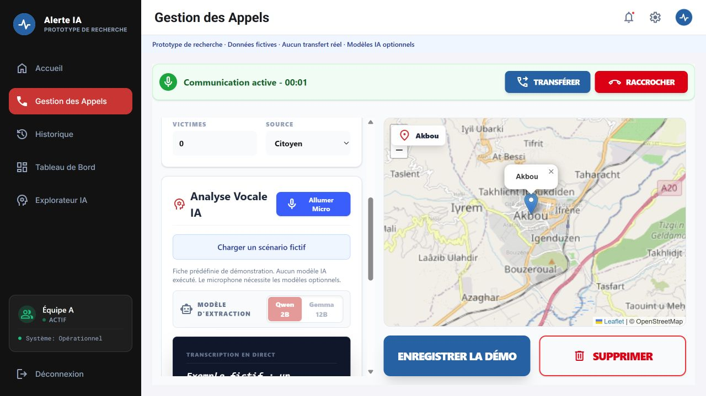

# Alerte IA

Collaborative emergency-call research prototype.



## Repository status

This repository contains a sanitized public adaptation of the existing collaborative prototype: a **FastAPI backend** and a **Next.js/TypeScript operator interface**. The default local demo uses **three entirely fictional scenarios**, predefined incident fields and deterministic statistics. It runs without a GPU, model downloads or API credentials.

The cover illustrates the intended audio → transcription → structured incident workflow using fictional information. This is a **research prototype**, with simulated call and transfer controls. It is not an operational emergency-response system.

## Project

The collaborative prototype combines a Python/FastAPI backend with a Next.js/TypeScript frontend. Its operator interface is intended to present transcription and structured incident information.

Rayan Terki's role is software development: collection and annotation tools, model integration, and contributions to the operator interface.

## Run the local demo

Requirements: Python 3.12 and Node.js 22 with npm. From the repository root:

```sh
python -m venv .venv
```

Activate the environment (`.venv\Scripts\Activate.ps1` on Windows PowerShell, or `source .venv/bin/activate` on macOS/Linux), then:

```sh
python -m pip install -r backend/requirements.txt
python -m uvicorn backend.main:app --host 127.0.0.1 --port 8000
```

In a second terminal:

```sh
cd frontend
npm ci
npm run build
npm start
```

Open **http://localhost:3000**, choose a demo team, then click **Charger un scénario fictif** on the Appels page. The scenario fills the transcript and incident fields. **Enregistrer la démo** updates the local history, dashboard and analytical assistant. Nothing is sent to an emergency service. The three scenario dates and all incident details are fictional.

Available pages: Appels, Historique, Tableau de bord and Explorateur IA. The team selector is a demo preference, not authentication. The assistant uses a limited keyword parser and deterministic aggregates in the default mode. Relative date filters use the latest date in the fictional dataset as their reference.

## Optional model adapters

The existing Whisper transcription adapter and Qwen/Gemma extraction adapters are included as source code. **Model weights, checkpoints and training/evaluation datasets are not included.** The default demo does not execute these models or fabricate an audio transcript. Its incident fields are predefined fixtures, not AI predictions.

To use your own authorized checkpoints, install `backend/requirements-models.txt` in a suitable environment and configure process environment variables before starting the backend:

| Variable | Purpose |
| --- | --- |
| `DGPC_ENABLE_MODELS=1` | Opt in to the model adapters |
| `DGPC_ASR_MODEL_DIR` or `DGPC_ASR_MODEL_ID` | Local ASR checkpoint or accessible Hugging Face model |
| `DGPC_ASR_PROCESSOR_ID` | Optional compatible processor |
| `DGPC_ASR_LANGUAGE` | Optional language hint; unset by default |
| `DGPC_EXTRACTOR_QWEN_ID`, `DGPC_EXTRACTOR_GEMMA_ID` | Compatible extraction checkpoints |
| `DGPC_EXTRACTOR_DEFAULT` | `qwen` or `gemma` |
| `DGPC_RAG_LLM_MODEL` | Optional local query-planning model |
| `DGPC_API_TARGET` | Frontend proxy target, default `http://127.0.0.1:8000` |

Model inference has **not been validated as part of this public release**. It requires compatible model access, dependencies and hardware. The API returns HTTP 503 when audio transcription is unavailable. This release reports no model accuracy or real-world performance claims.

## Interface previews

Actual captures of the local public demo, using fictional scenarios only:





## Public release scope and data

Only reviewed application source and newly authored fictional fixtures are published. Real emergency-call recordings, transcripts, caller details, original histories, CSV/JSONL datasets, credentials, environment files, checkpoints and internal documents are excluded. Displayed phone identifiers are non-dialable demo labels.

Local changes are stored in the ignored `backend/runtime/` directory. The committed `backend/demo_cases.json` stays unchanged. Use fictional data when exploring the demo. To reset it, stop the backend and remove only the generated `backend/runtime/` directory.

This is a collaborative project. Rayan Terki's role is software development; this repository does not claim sole authorship of the project, a research degree, or ownership of research results.

## Validation

```sh
python -m pip install -r backend/requirements-dev.txt
python -m unittest discover -s tests -v
python scripts/check_public_release.py
cd frontend
npm run lint
npm run build
```

CI checks the public file set, API demo behavior and frontend build. Tests cover synthetic scenario loading, structured fields, aggregate statistics, persistence isolated from the fixtures, and explicit unavailability of unconfigured ASR. The public release check rejects excluded datasets, recordings, environment files and common credential patterns.

## Links

- [Rayan Terki's portfolio](https://rayantr06.github.io/Portfolio-/)
- [GitHub](https://github.com/rayantr06)
- [LinkedIn](https://www.linkedin.com/in/rayan-terki/)
